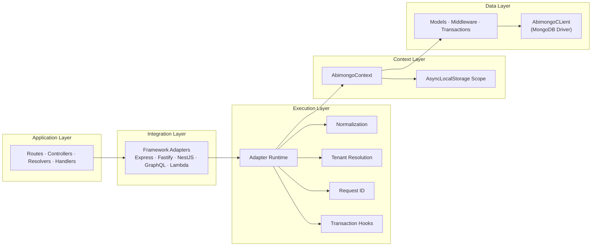
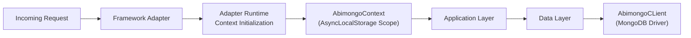

# Abimongo Architecture Overview

This document provides a high-level overview of how Abimongo works internally and the design principles behind it.

---

## Core Philosophy

Abimongo is built around a simple idea:

> **Context-driven data access for modern applications**

Instead of tightly coupling data logic to frameworks, Abimongo introduces a runtime-agnostic execution model.

---

## Architecture Layers



---

## Key Components

### 1. AbimongoContext

Central to the system.

```ts
AbimongoContext.get()
```

Stores:

- tenantId
- requestId
- session
- db/client reference

## 2. Adapter Layer

Responsible for:

- normalizing requests
- initializing context
- wrapping execution

Adapters include:

- Express
- Fastify
- NestJS
- GraphQL
- Lambda

## 3. Adapter Runtime

Shared execution engine.

```ts
runWithAdapterContext(...)
```

Handles:

- tenant resolution
- request ID propagation
- transaction wrapping

## 4. Model Layer

Provides:

- CRUD operations
- middleware hooks
- schema validation

## 5. Middleware System

Lifecycle hooks:

- beforeFind
- afterCreate
- beforeUpdate

Used for:

- soft delete
- auditing
- validation

## 6. Transaction Engine

Supports:

- automatic transactions
- manual transactions
- nested transaction reuse

### Execution Flow



---

## Design Principles

### 1. Framework Agnostic

- No dependency on Express, NestJS, etc.
- Adapters handle integration

### 2. Context First

- Context is the foundation
- Eliminates manual state passing

### 3. Composability

- Middleware-driven architecture
- extensible hooks

### 4. Isolation by Default

- tenant-aware execution
- transaction safety

### 5. Minimal Overhead

- lightweight abstractions
- near-native MongoDB performance

---

## Why This Architecture Matters

Traditional ODMs:

- tightly coupled to frameworks
- require manual session passing
- difficult to scale across runtimes

Abimongo:

- decoupled from runtime
- consistent behavior everywhere
- optimized for multi-tenant systems

---

## Comparison (Conceptual)

| Feature | Traditional ODM | Abimongo |
|--------|----------------|----------|
| Framework Coupling | High | None |
| Context Handling | Manual | Automatic |
| Multi-Tenancy | Custom | Built-in |
| Transactions | Manual | Automated |
| Runtime Flexibility | Limited | High |

---

## Future Direction

- adapter ecosystem expansion
- GraphQL-first integrations
- distributed context propagation
- enhanced observability

---

## Final Thought

Abimongo is not just an ODM.

It is a **runtime-aware data access layer** designed for modern, scalable, and multi-tenant systems.
